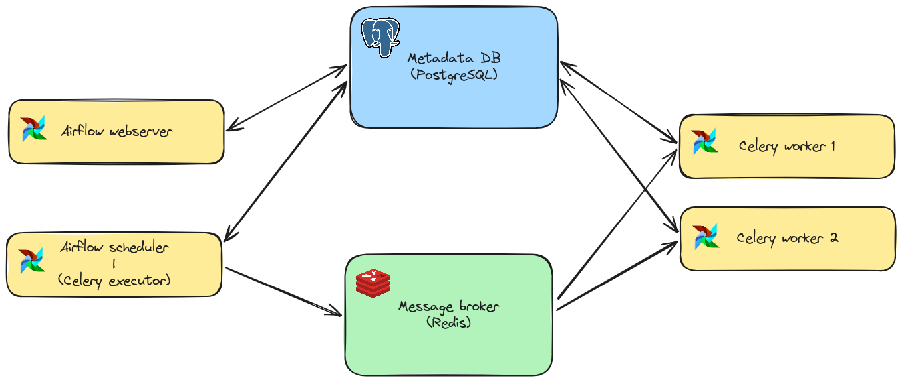
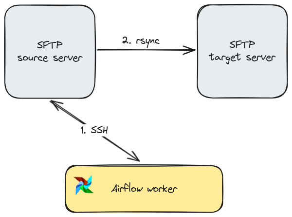
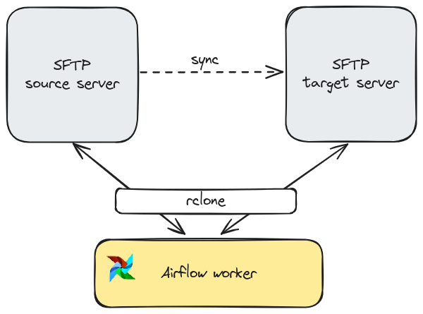
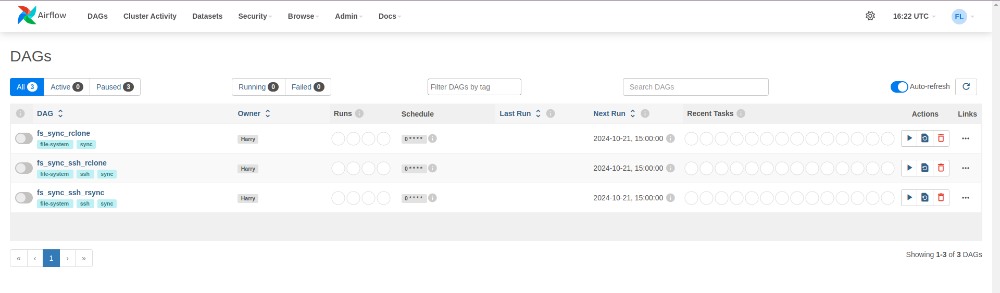
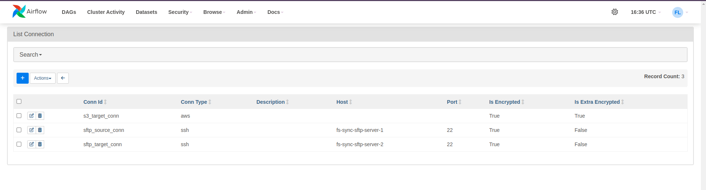
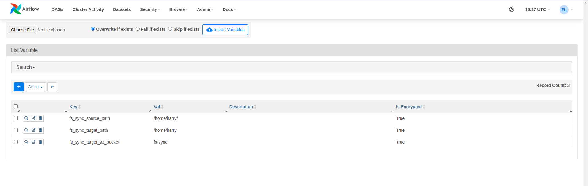
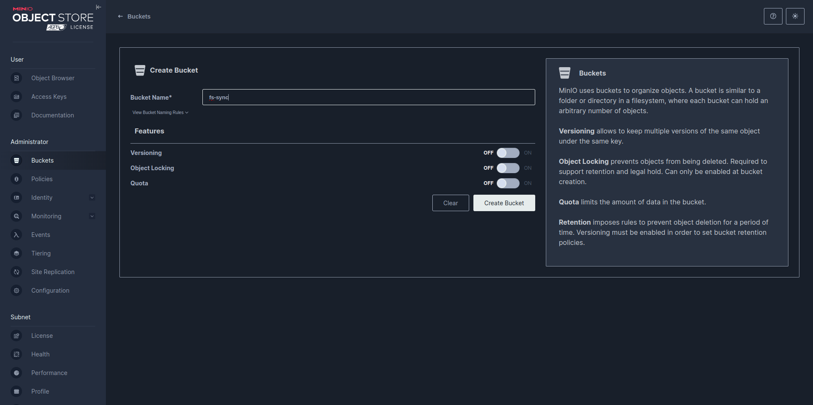
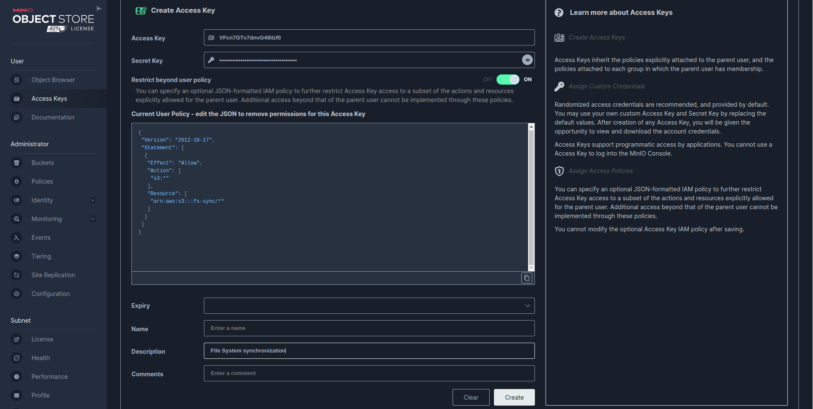
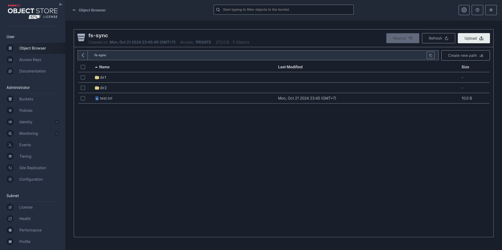

# File System synchronization

A **unidirectional file synchronization system** between two **SFTP servers** ensures that files from a **source server** are consistently **replicated** to a **destination server**, maintaining an exact copy.
The system **continuously monitors** the source server for **changes** (such as **new files** and **modifications**) and applies these updates to the destination server, ensuring the **data flows** only in **one direction**.
This setup is crucial for **backup** processes, **data migrations**, and environments where one server serves as a primary data source and the other as a **backup** or **passive replica**.

## 1. Prerequisites
* **Python** (3.12 or newer)
* Two **SFTP servers** (better if SSH connection is enabled)
* Docker (27.2.0 or newer)
* Docker Compose (v2.29.2 or newer)

## 2. Setup
This system leverages [Apache Airflow](https://airflow.apache.org/) as the orchestration tools to schedule the synchronizations processes. The architecture is as following image


To simplify the setup process, for demo only, I recommend using **Docker Compose** to install all necessary Airflow components.
Also ensure that the **mounted directories** grant sufficient **permissions** to avoid `Permission denied` error.

**NOTE**: I also included SFTP servers into the `docker-compose.yml` for demonstration, you can safely omit these services.

## 3. Proposed approaches
### 3.1. Rsync
_Reference_: https://github.com/RsyncProject/rsync

`rsync` is a robust command-line tool designed for efficiently transferring and synchronizing files between directories on local or remote systems. It stands out for its ability to perform delta transfers, meaning it only transfers the changed parts of files, which significantly reduces data transfer times.
`rsync` also preserves file attributes like permissions, timestamps, and ownership, making it ideal for backups and mirroring directories. Additionally, it supports secure remote transfers over SSH and offers features like compression, file exclusion, and dry runs to preview actions before they’re executed.

Unfortunately, `rsync` does not directly support transferring files between two remote servers. It typically requires that one of the systems involved in the file transfer be local. However, there are some workarounds for this approach:
1. **Pull files from source server to local machine, then push to target server**: This workaround seems inefficient since it doubles transfer time, and causes heavy workloads on Airflow worker. This is the only solution when the servers are network-isolated from each other.
2. **SSH into one of the servers, then rsync**: When the servers are accessible to each other, we can SSH into one of these servers, then safely synchronize file system changes between local machine and remote server (the other one). This is also my solution for `rsync` approach.



### 3.2. Rclone
_Reference_: https://github.com/rclone/rclone

`rclone` is a versatile tool for managing and syncing files between local storage and various cloud storage providers such as Google Drive, Dropbox, and Amazon S3. Its key feature is broad cloud provider support, allowing seamless transfers and synchronization across multiple cloud services.
`rclone` excels in efficiency with delta transfers, bandwidth limiting, and parallel transfers, and it also supports encryption for secure cloud backups. It can even mount cloud storage as a local file system and handle complex tasks like server-side transfers and deduplication, making it an excellent choice for cloud-based file management and backups.

Unlike `rsync`, `rclone` natively supports file transfer between two remote servers, even they are SFTP servers, distributed file systems, or object storages. Hence, it mitigates the effort of SSH session establishment, compared to the previous approach.

However, let's deeply discuss this approach. The **server-side copying**, i.e. direct copy between two servers, is only available when the remote servers support this feature. Otherwise, under the hood, `rclone` might download the files to your local machine temporarily before uploading them to the target, which turns out that the drawback stated in the previous section hasn't been resolved yet. 

#### 3.2.1. Rclone over SSH
This is similar to `ssh-rsync` way that I have discussed before. The prerequisite is available `rclone` on the SSH-ed server.


#### 3.2.2. Rclone by Airflow worker
The `rclone` command can be also executed by the Airflow worker. This way takes advantages of variety of remote servers support, introduces reusable Airflow operator, and leverages server-side copying of `rclone` without bottleneck on Airflow workers.

This is one of the most potential solutions when the problem is further extended to synchronization between servers, distributed file systems, object storages, or any type of supported storages.



## 4. Demonstration

Firstly, build the whole architectures by Docker Compose. Be patient until all containers are started/healthy.
```shell
docker compose up -d
```
Output:
```text
[+] Running 13/13
 ✔ Container fs-sync-redis-1              Healthy 
 ✔ Container fs-sync-minio2-1             Started 
 ✔ Container fs-sync-postgresql-1         Healthy 
 ✔ Container fs-sync-sftp-server-1        Started 
 ✔ Container fs-sync-sftp-server-2        Started 
 ✔ Container fs-sync-airflow-1            Started 
 ✔ Container fs-sync-airflow-worker-1     Started 
 ✔ Container fs-sync-airflow-worker-2     Started 
 ✔ Container fs-sync-minio1-1             Started 
 ✔ Container fs-sync-minio4-1             Started 
 ✔ Container fs-sync-minio3-1             Started 
 ✔ Container fs-sync-minio-1              Started 
 ✔ Container fs-sync-airflow-scheduler-1  Started 
```

Now Airflow UI is available (default url: http://localhost:8080), and 3 DAGs in the source code are shown after successfully parsed as following image. In this demonstration, the synchronization process is triggered hourly, we can change this behaviour by setting `schedule` argument of the DAG.


Since the server configurations might vary, we should make use of Airflow connections and variables, setup as following instructions (ensure the connection id and variable name)



We are nearly all set, now prepare content of synchronized directory in the source server. For example,
```text
noname:~$ tree .
.
├── dir1
│   ├── dir11
│   │   └── dir111
│   │       └── test111.txt
│   └── dir12
│       └── test12.txt
├── dir2
│   └── test2.txt
└── test.txt

5 directories, 4 files
```

Let's play, run each DAG and check the target server. To ensure successful replication, clear the synchronized directory of the target server before testing another approach. Moreover, during testing, try creating new files, modifying existing files, and deleting files on the source server, then manually trigger DAG to verify the synchronization. Expected results are:
* Creation / Update: **Synced**
* Deletion: **Not synced**

In this demonstration, I also enhance the problem to synchronizing file system changes from SFTP server to S3-compatible storage (**MinIO**). To prepare object storage, follow these instructions:
* Create S3 bucket

* Create S3 access key (with minimum permissions). Remember to copy the secret key since we no longer be able to access it after access key creation.


Finally, trigger the `fs_sync_rclone` DAG and see the results

